# SKMZ - Jenkins CI-CD Pipeline

A web application that allows to query programmers
with their skills via a **GraphQL** API. The
application is implemented with **Go** and
**[gqlgen](https://github.com/99designs/gqlgen)**
on the backend side and **React** on the front end
side. **MongoDB** is used as a database.


## Pipeline Architecture


### AWS Infrastructure setup

- Create an security group with following inbound rules:

  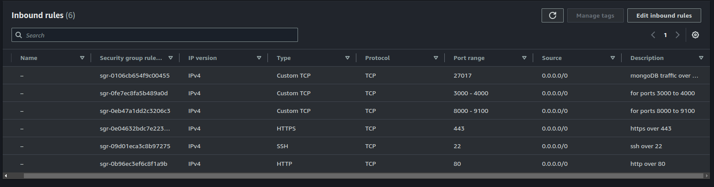

- Create an EC2 instace with following configurations:

  - image - Ubuntu 22.04LTS
  - size - t2.large (recommended)
  - storage - 25GB
  - security group - defined above

- Set the server

  - ssh to the instance
  - create a installation script `<script-name>.sh>` with given details:

    ```#!/bin/bash
        echo
        echo "------------------------------Updating System------------------------------"
        echo
        sudo apt update -y

        # pre Jenkins installation
        echo
        echo "------------------------------Installing Jenkins------------------------------"
        echo
        sudo apt install maven -y

        # jenkins installations
        sudo wget -O /usr/share/keyrings/jenkins-keyring.asc \
        https://pkg.jenkins.io/debian-stable/jenkins.io-2023.key
        echo "deb [signed-by=/usr/share/keyrings/jenkins-keyring.asc]" \
        https://pkg.jenkins.io/debian-stable binary/ | sudo tee \
        /etc/apt/sources.list.d/jenkins.list > /dev/null

        sudo apt-get update -y
        sudo apt-get install jenkins -y
        sudo systemctl enable jenkins
        sudo systemctl start jenkins

        # docker installation
        echo
        echo "------------------------------Installing docker------------------------------"
        echo
        sudo apt-get install ca-certificates curl -y
        sudo install -m 0755 -d /etc/apt/keyrings -y
        sudo curl -fsSL https://download.docker.com/linux/ubuntu/gpg -o /etc/apt/keyrings/docker.asc
        sudo chmod a+r /etc/apt/keyrings/docker.asc

        # Add the repository to Apt sources:
        echo \
          "deb [arch=$(dpkg --print-architecture) signed-by=/etc/apt/keyrings/docker.asc] https://download.docker.com/linux/ubuntu \
          $(. /etc/os-release && echo "$VERSION_CODENAME") stable" | \
          sudo tee /etc/apt/sources.list.d/docker.list > /dev/null
        sudo apt-get update -y
        sudo apt-get install docker-ce docker-ce-cli containerd.io docker-buildx-plugin docker-compose-plugin -y

        sudo chmod 777 /var/run/docker.sock

        echo
        echo "------------------------------running sonarqube docker container   ------------------------------"
        echo
        docker run -d --name sonar -p 9000:9000 sonarqube:lts-community


        # trivy installation
        echo
        echo "------------------------------Installing Trivy ------------------------------"
        echo
        sudo apt-get install wget apt-transport-https gnupg lsb-release
        wget -qO - https://aquasecurity.github.io/trivy-repo/deb/public.key | sudo apt-key add -
        echo deb https://aquasecurity.github.io/trivy-repo/deb $(lsb_release -sc) main | sudo tee -a /etc/apt/sources.list.d/trivy.list
        sudo apt-get update -y
        sudo apt-get install trivy -y


        docker --version
        dcpker compose version
        trivy --version


    ```

  - run the command to execute the script : `chmod +x <script-name>.sh && ./<script-name>.sh`

- **Access jenkins at port 8080 & setup**

  - <"public-ip-add>:8080
  - follow the instructions & setup jenkins

    - ssh into the instace & cat the given jenkins directory for password.
    - Dashboard> Manage Jenkins> Plugin > Available Plugins

    install the below shown plugins

  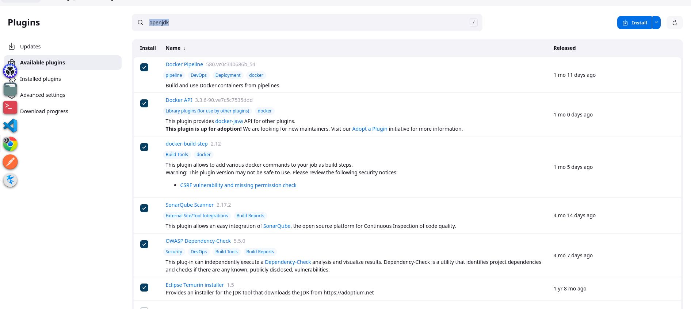

  - Go to Dashboard> Manage Jenkins> Tools & configure the installed plugins with requirement of application, such as :

    - jdk17
    - sonarqube
    - docker latest

- **Access sonaqube at port 9000 & setup**

  - user : admin pass: admin

  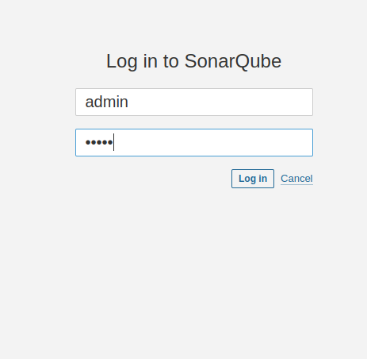

  - generate token for jenkins connection at `Adminstrations> Securty`
    | add token for Administrator.

  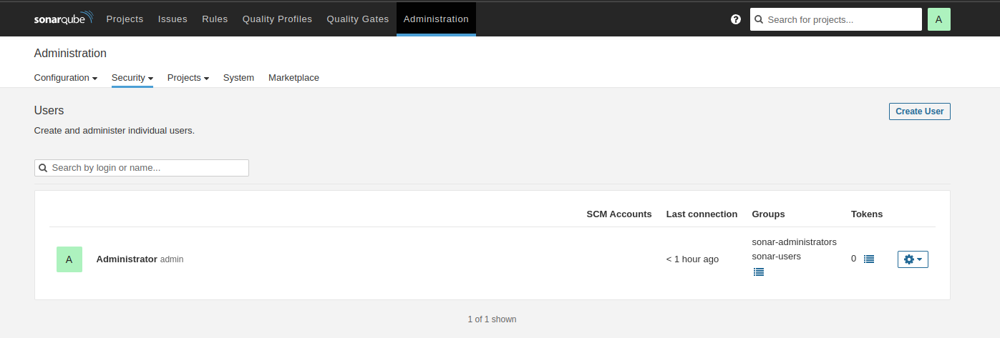

  

- **Setup the credentions for sonarcube in Jenkins**

  - in `manage Jenkins > credentionals` add serecet text (token generated) and giver name as sonar-cred.

- **Create Pipeline for the SKMS Application**

  - build a new item with pipeline configuration.
  - select `delete previous builds` & set it to 3 (at max).
  - Configure the pipeline with the script given in [Jenkins](https://github.com/syash7202/skmz-app-ci-cd/blob/master/Jenkinsfile)

  - Build the pipeline.

## **App accessble at port 8500 (as configured)**

- `SKMS APP`

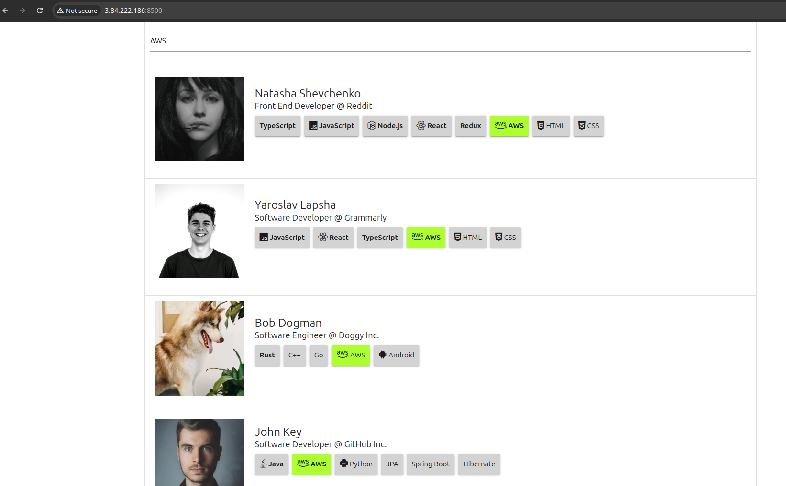
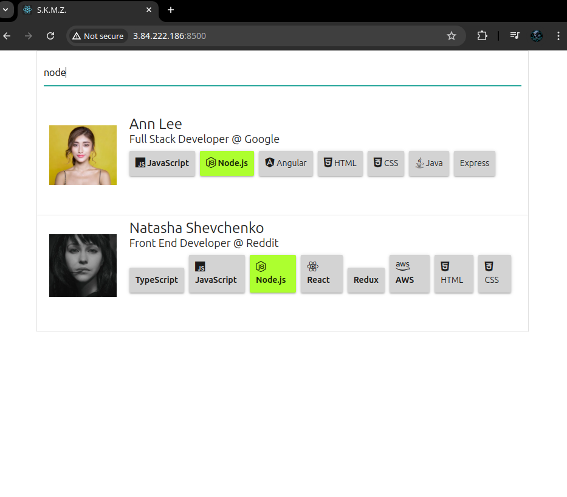
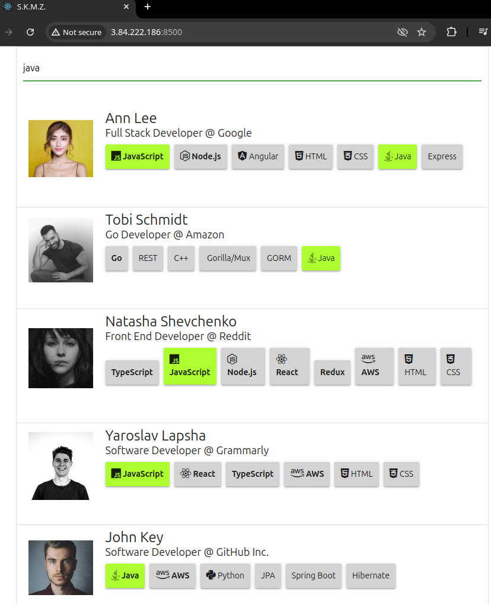

- `SKMS Playground`

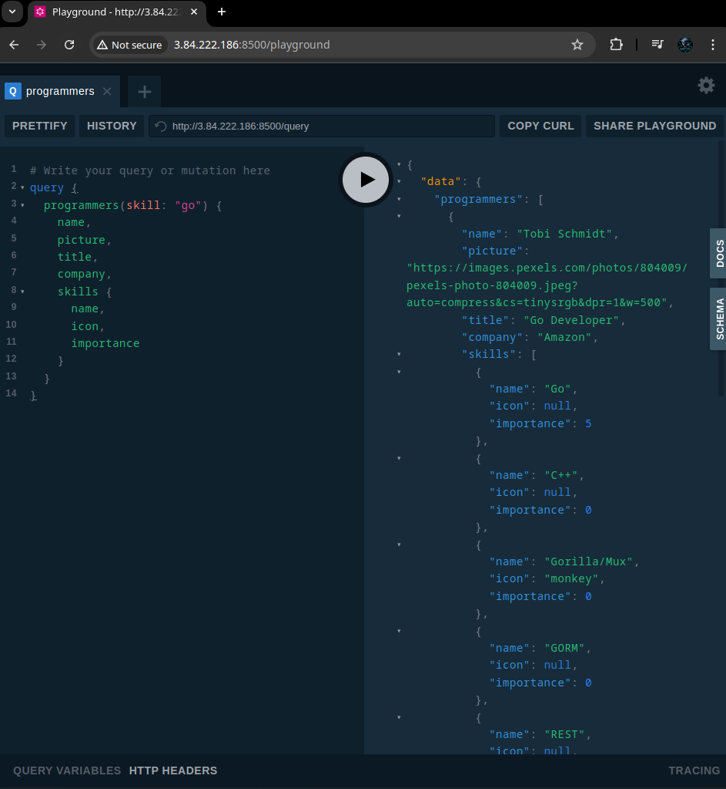

- **Outputs from Successfull build**

  - `Pipeline stage view`

  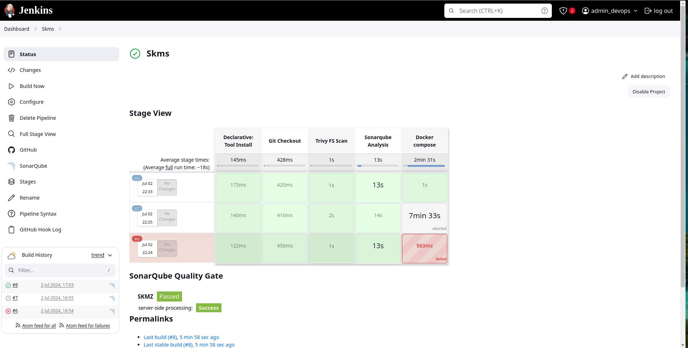

  - `Pipeline console output for build success`

  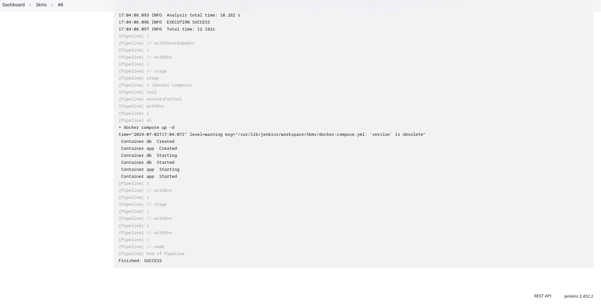

  - `Pipeline console output for Sonarqube Scan`

  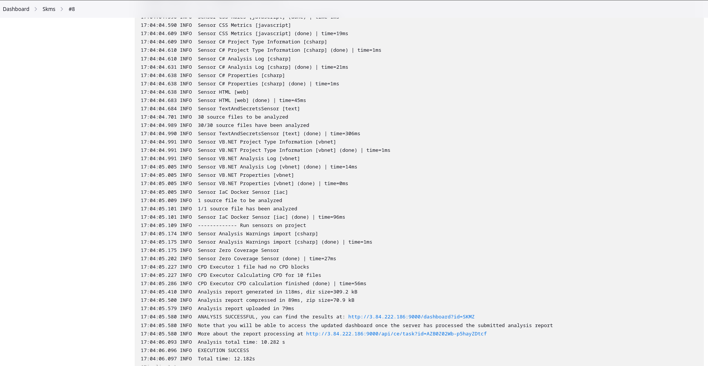

  - `Output for Sonarqube Scan at sonarqube server`

  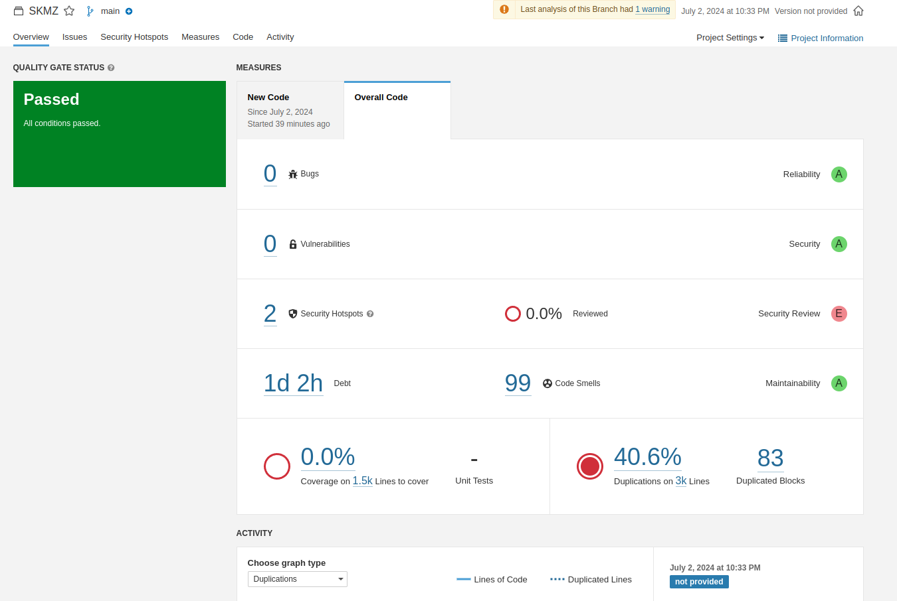

  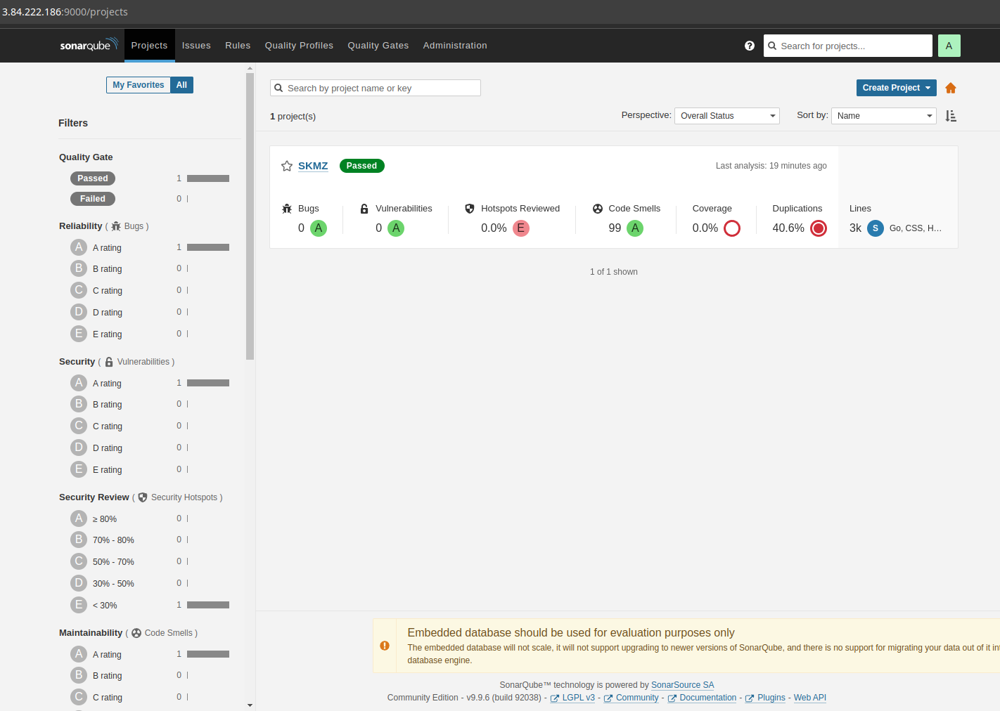
